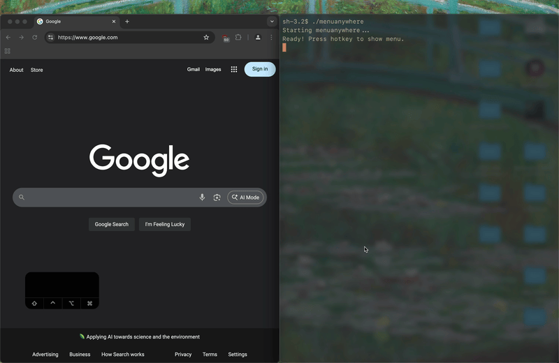

# menuanywhere
tired of clicking bad menu bar items in my sketchybar that are slow and dont line up and also didn't want to pay for menuwhere so here we are.



## installation
```bash
brew tap acsandmann/tap
brew install menuanywhere
```

## config
```cjson
// config is located in ~/.config/menuanywhere/config.json
// config provided is the default
{
  "key": "m",
  "modifiers": ["control"]
}
```
